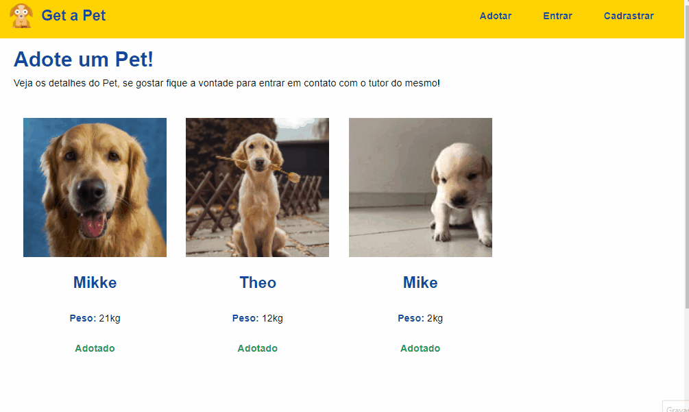

# Get a Pet

Um site para adotar Pets, fiz esse projeto com intuito de colocar em pratica oque aprendi, Meus maiores ensinamentos com este projeto foram:
<li> Noções de API
<li> Noção de fluxo de informaçôes
<li> Sistema de login/register 
<li>Autenticação de Usuario
<li> CRUD With MongoDB

## 🔧 Funçoes 

### Função 01:
- Registro de Usuario/Pet

### Função 02:
- Rotas protegidas por token
  
### Função 03:
- Adicionar/Remover imagem de Usuario/Pet 

## Veja o desenvolvimento do projeto:

Para ver o desenvolvimento acesse o planejamento:

## Feito Com:

  

## Getting Start
  
Para rodar o projeto é preciso o clone do Front e Backend da aplicação <a href='https://github.com/GustavoMen/Get-a-pet-BACKEND-'>Clique aqui</a> para acessar o Backend

  
## Git Clone

- create an folder for Backend and Frontend: 
$ cd "Folder name"  
- Clone this repository: 
$ git clone https://github.com/GustavoMen/Get-a-pet-FRONTEND-
- Enter in directory:
$ cd frontend
- For install dependencies:
$ npm install
- Run the app: 
$ npm start

### Support Ou Contato

  
 
 Feito por Gustavo Mendonça
